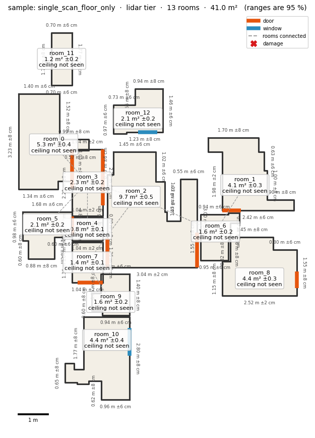
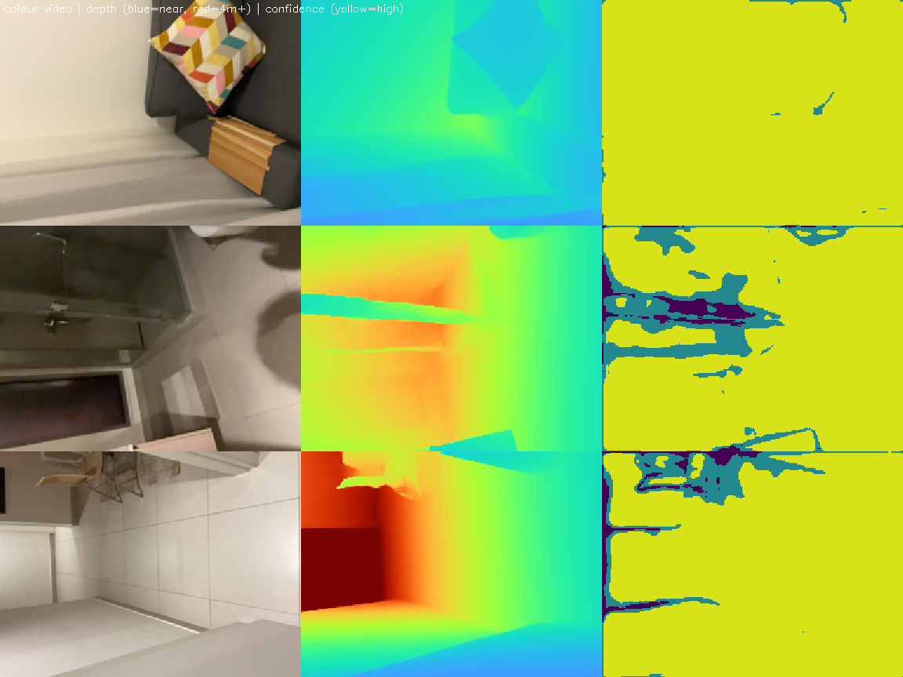

# Roomscan

**Phone capture in, dimensioned floor plan out.** One command turns a LiDAR scan, a walkthrough video or a
few photos per room into a whole-property floor plan: rooms placed and connected, walls, floor areas,
ceiling heights, doors and windows, damage regions with hidden-damage flags and repair line items — with a
**95 % range on every number**. JSON to a published schema plus a rendered plan.

> Built in ~42 hours for the Applied AI Engineer case study, without an iPhone. Start with
> [`docs/compliance_matrix.md`](docs/compliance_matrix.md) (every requirement → file → status) and
> [`docs/TRADEOFFS.md`](docs/TRADEOFFS.md) (assumptions, limitations and what we did instead, with numbers).

<p align="center"> </p>
<p align="center"><em>Left: our own home from 24 phone photos (photo tier). Right: the provided LiDAR sample, 13 rooms.</em></p>

## Results at a glance
Measured against tape on our own home (bedroom, hall, kitchen, bathroom; Samsung Galaxy M53) and on the
provided sample captures. Details and every gate: [`docs/benchmark_report.md`](docs/benchmark_report.md).

| | Result | Gate |
|---|---|---|
| Photo tier, whole-home footprint | **+6 %** (protocol capture), all 4 rooms placed and connected, no overlaps | ±8 % ✅ |
| Photo tier, per-room areas | −21 % … +42 % | ±8 % ❌ |
| Video tier | bedroom −31 %, bathroom +92 %; only part of a walk survives pose tracking | ±3 % ❌ |
| Repeatability (same room twice) | 0 of 3 walls (video), 0 of 14 (LiDAR sample) | 1 cm ❌ |
| Fix loop ([`docs/fix_loop.md`](docs/fix_loop.md)) | photo footprint **+30 % → +7.5 %** on the same photos | — |
| Calibration | tape value inside our 95 % range for 4/4 room areas and 16/16 walls (ranges wide) | honest ✅ |
| Damage | staged stain found, staged crack missed, 12 false alarms on photos | — |
| Not done | LiDAR-tier ground truth and Polycam head-to-head (no LiDAR iPhone) | — |

## How it works
Every input is turned into the **same intermediate capture** — depth images + camera poses + lens
intrinsics in metres — and **one back end** builds the plan. Tiers differ only in their front end and in how
wide their ranges are.

```
LiDAR  (Stray Scanner export) ─ depth + ARKit poses ───────────────────────────┐
Video  (.mp4/.mov)  ─ sharp frames → VGGT poses + depth → Depth Anything scale ─┼→ planes → rooms → walls,
Photos (room folders) ─ per room: VGGT + Depth Anything + EXIF focal ───────────┘   doors, ceilings → ranges
                                                         → rooms connected → damage → rules → plan.json + plan.png
```

<p align="center"><br>
<em>What a capture contains: colour, LiDAR depth (blue = near) and LiDAR confidence.</em></p>

Key decisions (why, in [`docs/technical_report.md`](docs/technical_report.md) and
[`docs/INTERVIEW_NOTES.md`](docs/INTERVIEW_NOTES.md)):
- Planes from **seeded, normal-consistent RANSAC** (Open3D's threaded RANSAC was not repeatable; plain RANSAC
  invented floors at every height).
- **Rooms** = floor split at doorways (distance transform + watershed); **doors/windows** = wall areas that
  depth rays pass *through*, so an unseen wall is never called an opening.
- **Honest ranges**: an unseen ceiling is reported as a wide, flagged range — never a confident number.
- Pretrained models only (disclosed): VGGT-1B, Depth Anything V2 Metric-Indoor, Grounding DINO, SAM 2.1.

## Quickstart (Linux, Python 3.10+)
    sudo apt install ffmpeg                                   # video tier decodes with ffmpeg/ffprobe
    python3 -m venv .venv
    .venv/bin/pip install -r requirements.txt                 # LiDAR tier (CPU only)
    .venv/bin/pip install -r requirements-models.txt          # video + photo tiers (NVIDIA GPU, >= 8 GB)
    .venv/bin/python scripts/fetch_weights.py                 # model weights (~7.8 GB, once)

One command per capture; the tier is detected from what you pass:

    .venv/bin/python run.py <stray_scanner_folder>            # LiDAR tier
    .venv/bin/python run.py <walkthrough.mp4>                 # video tier
    .venv/bin/python run.py <folder_of_room_folders>          # photo tier (one sub-folder of photos per room)

Output: `outputs/<name>/plan.json` (schema: [`schema/plan.schema.json`](schema/plan.schema.json)), `plan.svg`,
`plan.png`. How to capture: [`docs/capture_protocol.md`](docs/capture_protocol.md) (one page). Options:
`--tier`, `--drift-correction on|off`, `--rotate`, `--no-damage`.
Verified on a fresh clone: install 71 s, LiDAR run 33 s.

## Reproduce every number
    .venv/bin/python scripts/fetch_data.py          # our own raw captures (Google Drive) -> data/raw/m53
    bash scripts/reproduce_all.sh                   # all tiers on the sample + our home (GPU); `lidar` = CPU part only
    .venv/bin/python scripts/score_m53.py           # tape-measured scores -> outputs/m53_benchmark.json

Committed results: [`results/`](results). Fix loop before/after: tags `fix-before`, `fix-after`
([`docs/fix_loop.diff`](docs/fix_loop.diff)). Tests: `.venv/bin/python -m pytest -m "not model"` (CPU, ~4 min)
and `-m model` (GPU).

## Repository map
| Path | What |
|---|---|
| `run.py`, `roomscan/pipeline.py` | the one command; tier detection; LiDAR pipeline |
| `roomscan/load_capture.py` … `measurements.py` | back end: capture → points → planes → rooms → outlines → openings → ranges |
| `roomscan/split_rooms.py`, `room_surfaces.py`, `connect_rooms.py`, `drift_correction.py` | multi-room plan, adjacency, drift |
| `roomscan/video_*.py` | video tier front end |
| `roomscan/photo_*.py`, `stitch_rooms.py` | photo tier front end and stitching |
| `roomscan/damage_*.py`, `repair_scope.py` | damage detection, measurement, rules R1-R5, scope |
| `roomscan/score_benchmark.py`, `compare_plans.py`, `scripts/` | scoring, repeatability, evaluations, reproduction |
| `docs/` | reports, protocol, device matrix, trade-offs; `docs/plans/` = the build plans as written |
| `data/ground_truth/` | tape measurements (raw notes + CSV) |
| `tests/` | 190+ tests (synthetic rooms with known answers + sample data) |
