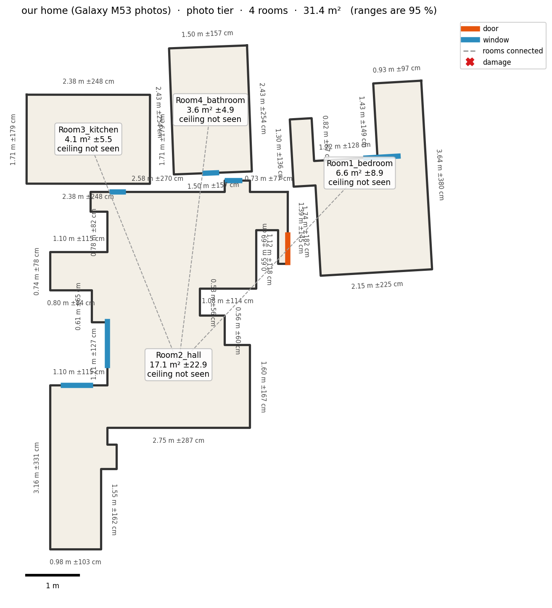

# Roomscan

Turn a phone capture, LiDAR scan, walkthrough video, or a few photos per room, into a dimensioned
whole-home floor plan, with a 95 % range on every measurement.

<p align="center"></p>

## Quickstart

```bash
sudo apt install ffmpeg
python3 -m venv .venv
.venv/bin/pip install -r requirements.txt            # LiDAR tier (CPU)
.venv/bin/pip install -r requirements-models.txt     # video + photo tiers (NVIDIA GPU, 8 GB)
.venv/bin/python scripts/fetch_weights.py            # model weights, once
```

```bash
.venv/bin/python run.py <stray_scanner_folder>       # LiDAR
.venv/bin/python run.py <walkthrough.mp4>            # video
.venv/bin/python run.py <folder_of_room_folders>     # photos
```

Output: `outputs/<name>/plan.json` ([schema](schema/plan.schema.json)) and `plan.png`.
How to capture: [capture protocol](docs/capture_protocol.md).

## Results

Measured against tape on our own home (4 rooms, Samsung Galaxy M53).

| Measure | Result | Target | Status |
|---|---|---|---|
| Photo tier, whole-home footprint | +6 %, all rooms placed and connected in the right order | ±8 % | Pass |
| Photo tier, per room | −21 % to +42 % | ±8 % | Fail |
| Video tier | −31 % to +92 % | ±3 % | Fail |
| Fix loop, photo footprint | +30 % before, +7.5 % after | | |

Full results: [benchmark report](docs/benchmark_report.md).

## Documentation

- [Compliance matrix](docs/compliance_matrix.md), every requirement, where it is, its status
- [Trade-offs and assumptions](docs/TRADEOFFS.md), what we could not do and why
- [Technical report](docs/technical_report.md), architecture and design decisions
- [Fix loop](docs/fix_loop.md), declared fix, before / after
- [Device matrix](docs/device_matrix.md)

## Reproduce

```bash
.venv/bin/python scripts/fetch_data.py               # our raw captures
bash scripts/reproduce_all.sh                        # every reported number
.venv/bin/python -m pytest -m "not model"            # tests
```
